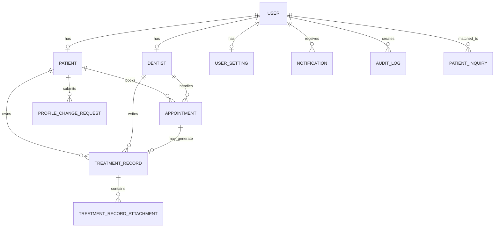
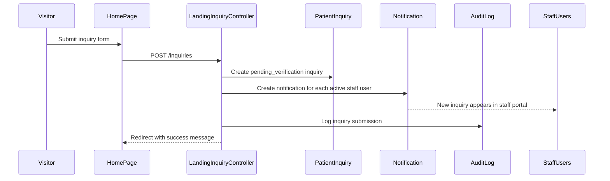
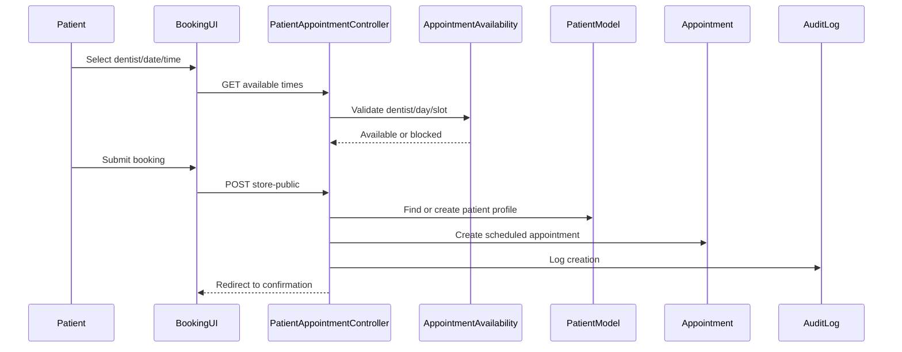

# Dental Clinic Management System

## 1. Project Summary

This project is a role-based Dental Clinic Management System (DCMS) built with Laravel, Inertia.js, and React. It supports four major user roles:

- `admin`
- `staff`
- `dentist`
- `patient`

The system combines:

- a public-facing landing page
- authenticated portal access
- appointment booking and scheduling
- patient registration and verification
- treatment history and file attachments
- notifications and reminders
- reports and exports
- system configuration and backup management
- audit logging for traceability

At a high level, Laravel handles routing, validation, business logic, persistence, exports, mail, and jobs, while React pages render the user interface through Inertia.

---

## 2. Tech Stack

### Backend

- Laravel 12
- PHP 8.2+
- Eloquent ORM
- Laravel Breeze authentication
- Inertia Laravel adapter
- Laravel queues and jobs
- DOMPDF for PDF export
- Laravel Excel for Excel export

### Frontend

- React 19
- Inertia.js React adapter
- Vite
- Tailwind CSS
- Chart.js / react-chartjs-2
- FullCalendar
- Lucide React icons

### Main architectural style

- Monolithic web application
- Server-driven SPA using Laravel + Inertia
- Role-segmented dashboards and modules
- Relational database-centered domain model
- Queue-backed asynchronous reminders/notifications

---

## 3. Application Architecture

## 3.1 Request/response model

1. Browser sends a request to Laravel.
2. Route middleware checks authentication and role.
3. Controller validates input and runs business logic.
4. Eloquent reads/writes domain models.
5. Controller returns either:
   - an Inertia page with props
   - a redirect with flash messages
   - a JSON response for async UI calls
   - a file download for exports/backups
6. Shared Inertia middleware injects auth, flash, and unread notification count.

## 3.2 Main layers

### Presentation layer

- React pages under `resources/js/Pages`
- role-specific layouts under `resources/js/Layouts`
- reusable UI components under `resources/js/Components`

### Application layer

- controllers under `app/Http/Controllers`
- middleware for auth/role gating
- support classes for availability, reporting, settings defaults

### Domain/data layer

- Eloquent models under `app/Models`
- migrations under `database/migrations`
- database-backed notifications, audit logs, settings, appointments, patients, treatments

### Async/integration layer

- mailables under `app/Mail`
- queued jobs under `app/Jobs`
- `AppointmentObserver` dispatches reminder/confirmation jobs

---

## 4. Module Map

## 4.1 Public module

- `Home.jsx`
  - marketing landing page
  - new patient inquiry form
- public booking pages
  - `Appointments/BookPublic.jsx`
  - `Appointments/Confirmation.jsx`

### Key backend controllers

- `LandingInquiryController`
- `Patient\AppointmentController` for self-booking endpoints

## 4.2 Admin module

- dashboard and KPI overview
- user management
- reports and analytics
- audit log
- system config
- backup management
- admin-created appointment booking

## 4.3 Staff module

- dashboard
- patient registration
- inquiry verification/conversion
- appointment management
- check-in queue
- reports
- notifications

## 4.4 Dentist module

- dashboard
- own appointments calendar
- assigned patients
- treatment record creation/editing
- attachment upload
- notifications

## 4.5 Patient module

- dashboard
- self-booked appointment list
- appointment cancellation
- treatment history and PDF download
- notifications
- profile management and sensitive-field change requests

---

## 5. Role Responsibilities

| Role | Main responsibilities |
| --- | --- |
| Admin | Manage users, view reports, review audit data, configure clinic settings, handle backup/restore, create appointments |
| Staff | Register patients, verify landing inquiries, manage appointments, send reminders, handle check-ins, monitor notifications |
| Dentist | View own schedule, manage own patients, create/edit treatment records, upload x-rays/photos, cancel own appointments |
| Patient | Book own appointments, view notifications, cancel upcoming appointments, view treatment history, manage profile/preferences |

---

## 6. Core Domain Entities

## 6.1 Main entities

- `User`
  - authentication identity
  - holds role, active flag, last login
- `Patient`
  - patient demographic and medical profile
  - optionally linked to a `User`
- `Dentist`
  - dentist profile linked to a `User`
  - includes specialization and schedule days
- `Appointment`
  - links patient and dentist
  - stores date, time, type, notes, status
- `TreatmentRecord`
  - clinical record for a patient visit
  - linked to dentist, patient, and optionally appointment
- `TreatmentRecordAttachment`
  - x-rays or procedure photos for treatment records
- `Notification`
  - in-app notification stored in database
- `AuditLog`
  - immutable activity trail
- `PatientInquiry`
  - landing-page intake record awaiting staff review
- `ProfileChangeRequest`
  - patient-requested change for sensitive fields
- `UserSetting`
  - per-user notification/UI preferences
- `SystemSetting`
  - clinic-wide config values

## 6.2 Entity relationship diagram

---

## 7. Important Business Rules

- Only authenticated `patient` accounts can use the self-booking flow.
- Appointment times are generated from clinic config (`config/clinic.php`).
- Dentist availability depends on:
  - dentist account being active
  - selected day matching `schedule_days`
  - no non-cancelled appointment conflict for the same slot
- Staff-created appointments default to `pending`.
- Patient self-booked appointments default to `scheduled`.
- Cancelled appointments are excluded from availability checks.
- Patient sensitive profile changes (`email`, `phone`, `medical_alerts`) use approval requests instead of direct updates.
- Treatment records are limited to the dentist who owns them.
- Dentist patient access is constrained to patients with appointments under that dentist.
- Notifications are role/user-specific and access-controlled.
- Audit logging is used across major create/update/cancel/export/backup actions.

---

## 8. End-to-End Data Flows

## 8.1 New patient landing inquiry flow

### Purpose

Captures an unverified prospective patient from the landing page and routes the request to staff for validation.

### Sequence

1. User fills out the inquiry form on `Home.jsx`.
2. Frontend posts to `POST /inquiries`.
3. `LandingInquiryController@store` validates input.
4. System checks whether `patient_inquiries` table exists.
5. System optionally matches the inquiry email to an existing user.
6. `PatientInquiry` record is created with status `pending_verification`.
7. All active staff users receive database notifications.
8. Audit log entry is created.
9. User is redirected back to home with a success flash message.

### Mermaid sequence

## 8.2 Inquiry conversion to registered patient flow

### Purpose

Allows staff to verify landing-page submissions and convert them into full patient records and patient portal accounts.

### Sequence

1. Staff opens inquiry list.
2. Staff opens conversion page for a specific inquiry.
3. Staff submits verified patient details and optional temporary password.
4. System finds or creates a `User` with role `patient`.
5. System updates or creates the related `Patient`.
6. Inquiry status becomes `converted`.
7. Notifications for that inquiry are marked read.
8. Audit log entry is created.

### Output artifacts

- `users` row
- `patients` row
- updated `patient_inquiries` row
- `audit_logs` row

## 8.3 Patient self-booking flow

### Purpose

Allows only logged-in patient users to book their own appointments.

### Sequence

1. Patient opens `/appointments/book`.
2. System confirms authenticated role is `patient`.
3. UI loads:
   - active dentists
   - clinic time slots
   - available booking days
   - existing non-cancelled appointments
4. UI requests available times for a chosen dentist/date.
5. Backend checks:
   - dentist active state
   - dentist schedule day
   - slot conflict
6. Patient submits booking form.
7. Backend resolves or creates linked patient profile.
8. Appointment is created with status `scheduled`.
9. Audit log entry is created.
10. User is redirected to confirmation page.

### Mermaid sequence

## 8.4 Staff-managed appointment flow

### Purpose

Allows staff to create, edit, remind, export, and cancel appointments for clinic operations.

### Create appointment sequence

1. Staff selects patient, dentist, date, time, type.
2. Controller validates the request.
3. Availability is checked through `AppointmentAvailability`.
4. Appointment is created with status `pending`.
5. Email is sent to dentist.
6. Optional email is sent to patient.
7. In-app notification is created for dentist.
8. In-app notification is created for patient.
9. Audit log entry is created.

### Reminder sequence

1. Staff triggers reminder.
2. `SendAppointmentReminderJob::dispatchSync` runs immediately.
3. Patient receives in-app notification.
4. Audit log entry is created.

### Update/cancel sequence

- update changes schedule details after conflict validation
- cancel marks status as `cancelled`
- exports generate PDF or Excel files

## 8.5 Dentist cancellation flow

### Purpose

Lets a dentist cancel one of their own future appointments.

### Sequence

1. Dentist opens own appointment calendar.
2. Dentist cancels a future appointment.
3. System verifies the appointment belongs to that dentist.
4. Appointment status becomes `cancelled`.
5. Patient receives cancellation email.
6. Patient receives in-app cancellation notification.
7. All staff users receive in-app cancellation notifications.
8. Audit log entry is created.

## 8.6 Treatment record flow

### Purpose

Lets dentists document clinical visits and attach supporting files.

### Sequence

1. Dentist chooses a patient from patients previously seen by that dentist.
2. Dentist submits visit date, procedures, notes, prescription, and tooth data.
3. System optionally links the treatment record to a same-day appointment.
4. Treatment record is stored inside a database transaction.
5. Uploaded files are stored on the `public` disk.
6. Attachment metadata is saved in `treatment_record_attachments`.
7. Audit log entry is created.

### Data produced

- treatment record row
- zero or more attachment rows
- files under `storage/app/public/treatment-records/...`

## 8.7 Patient profile change request flow

### Purpose

Separates direct profile edits from approval-required sensitive changes.

### Direct fields

- first name
- last name
- date of birth
- gender
- address

### Requested fields

- email
- phone
- medical alerts

### Sequence for requested fields

1. Patient submits a request with field/value.
2. Backend validates allowed field and format.
3. `ProfileChangeRequest` is created with status `pending`.
4. Audit log entry is created.
5. Request appears in patient history for tracking.

## 8.8 Reporting and export flow

### Purpose

Generates operational and analytical outputs for admin and staff.

### Data sources

- `appointments`
- `patients`
- `treatment_records`

### Processing

`App\Support\ReportData` computes:

- appointments by day
- daily summary
- patient growth by month
- procedure distribution
- revenue estimate
- appointments table

### Outputs

- admin dashboard charts
- admin reports page
- staff reports page
- PDF export
- Excel export

## 8.9 Backup and restore flow

### Purpose

Provides SQLite file-level backup management through the admin module.

### Sequence

1. Admin creates backup.
2. Database file `database/database.sqlite` is copied to `storage/app/backups`.
3. Backup metadata is shown in backup UI.
4. Admin can download, restore, or delete by validated filename pattern.
5. All operations are audit logged.

---

## 9. Cross-Cutting System Behaviors

## 9.1 Authentication and access control

- Laravel auth routes handle login, registration, password reset, and email verification.
- New self-registered users are created as `patient`.
- `/dashboard` redirects authenticated users to the correct role dashboard.
- `CheckRole` middleware gates route groups.

## 9.2 Inertia shared state

Every Inertia page can receive:

- authenticated user summary
- unread notification count for dentist/staff/patient roles
- flash messages

This is supplied by `HandleInertiaRequests`.

## 9.3 Notifications

Notifications are database records, not Laravel broadcast notifications.

Common notification types include:

- `patient_inquiry_submitted`
- `appointment_booked`
- `appointment_reminder`
- `appointment_confirmed`
- `appointment_cancelled`

## 9.4 Audit logging

`AuditLog::log()` centralizes action logging with:

- user id
- action
- module
- description
- IP address

This supports accountability and admin review.

## 9.5 Queue jobs and observers

`AppointmentObserver` is registered in `AppServiceProvider`.

### Created appointment

- schedules `SendAppointmentReminderJob` for 24 hours before the visit at 9:00 AM

### Updated appointment

- if status changes to `confirmed`, dispatches `NotifyAppointmentConfirmedJob`

This means some appointment side effects are asynchronous and depend on a running queue worker.

## 9.6 Config-driven scheduling

`config/clinic.php` drives:

- clinic opening hours
- slot interval
- allowed treatment procedure list

`ClinicHelper::generateTimeSlots()` uses this config for booking UIs.

---

## 10. Suggested Visuals For Documentation

These are the diagrams most worth building in your documentation set.

## 10.1 System context diagram

Show:

- Visitor
- Patient
- Staff
- Dentist
- Admin
- Web app
- Database
- Mail service
- Queue worker
- File storage

## 10.2 Container diagram

Show these runtime parts:

- React/Inertia frontend
- Laravel web app
- Eloquent models/database
- queue jobs
- mailables
- filesystem storage for attachments/backups

## 10.3 Role-to-module matrix

Visualize which role can access:

- dashboard
- appointments
- patients
- treatment records
- reports
- notifications
- settings
- backups
- user management

## 10.4 Entity relationship diagram

Use the Mermaid ERD in section 6.2 as the starting point.

## 10.5 Sequence diagrams

Recommended sequences:

- landing inquiry to staff notification
- inquiry conversion to patient account
- patient self-booking
- staff appointment creation
- dentist cancellation
- treatment record upload
- backup creation and restore

## 10.6 Data lifecycle diagram

A strong documentation visual would be:

`Visitor -> Inquiry -> Patient/User -> Appointment -> TreatmentRecord -> Export/Audit`

---

## 11. Folder-Level Documentation Notes

| Path | Purpose |
| --- | --- |
| `app/Http/Controllers` | Business actions per role/module |
| `app/Models` | Domain entities and relationships |
| `app/Jobs` | Async appointment side effects |
| `app/Mail` | Appointment email templates |
| `app/Support` | Availability rules, report building, settings helpers |
| `app/Observers` | Appointment lifecycle hooks |
| `resources/js/Pages` | Inertia React pages |
| `resources/js/Layouts` | Role-specific application shells |
| `resources/js/Components` | Reusable UI elements |
| `resources/views/pdf` | PDF export templates |
| `resources/views/emails` | Email Blade templates |
| `database/migrations` | Schema history |
| `database/seeders` | Seed/test bootstrap data |
| `tests/Feature` | Business-flow tests |
| `scripts` | maintenance, verification, testing helpers |

---

## 12. Test Coverage Worth Mentioning In Docs

The current test suite already documents several business rules:

- landing inquiry creation and staff notification
- inquiry conversion into patient account/record
- patient self-booking access restrictions
- appointment slot conflict prevention
- staff appointment booking/reminder/cancellation
- staff patient registration with duplicate-email handling
- role-based notification management
- user settings/profile preference updates

This is useful for a "validated behaviors" or "quality assurance" section in your documentation.

---

## 13. Risks, Constraints, and Documentation Notes

- The backup flow is SQLite-file based, so the current backup documentation should describe SQLite deployment assumptions.
- Notification delivery is database-based; real-time push/websocket behavior is not implemented in this codebase.
- Reminder and confirmation automation rely on queue workers actually running.
- Some feature availability is migration-sensitive:
  - `patient_inquiries`
  - `user_settings`
- Reports currently estimate revenue with a fixed multiplier rather than a billing/invoice model.
- There is no visible admin approval workflow yet for processing `ProfileChangeRequest`; the request capture exists, but approval handling is not exposed in the route map reviewed here.

---

## 14. Documentation Boilerplate You Can Reuse

### One-sentence system description

The Dental Clinic Management System is a role-based clinic operations platform that manages patient intake, appointments, treatment records, notifications, reporting, and administrative controls through a Laravel and React Inertia architecture.

### Short architecture summary

The application uses Laravel as the backend application layer and React with Inertia.js as the frontend presentation layer. Business logic is organized by role-specific controllers, persisted through Eloquent models, and extended with queue jobs, email notifications, exports, audit logs, and file-based backup handling.

### Short data flow summary

Most workflows begin with a user action in an Inertia React page, pass through a Laravel controller for validation and business rules, update one or more relational records, and then optionally trigger notifications, emails, queue jobs, exports, or audit log entries before returning an Inertia response or redirect.

---

## 15. Recommended Documentation Set

If your team is creating formal documentation, I would split it into these deliverables:

1. System overview
2. Architecture and tech stack
3. User roles and permissions
4. Database/entity model
5. Core business process flows
6. UI/module walkthrough by role
7. Reports, exports, and backups
8. Deployment/runtime requirements
9. Testing and quality assurance
10. Known constraints and future improvements

